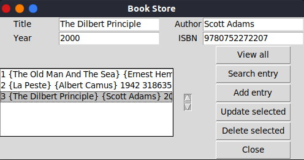
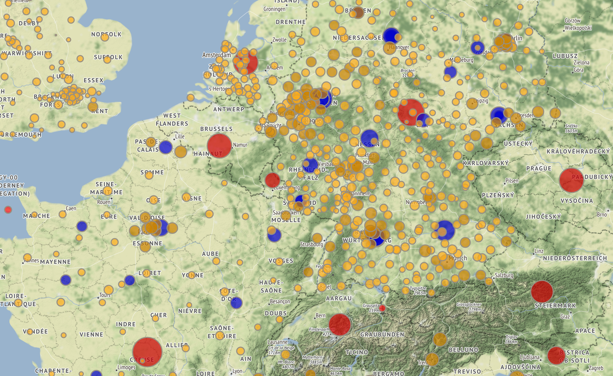
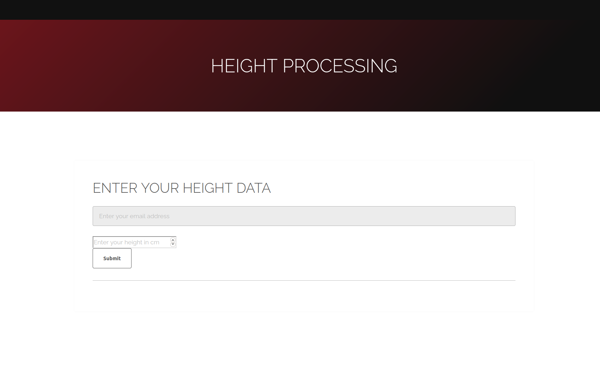
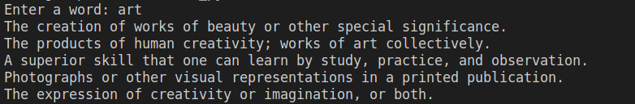
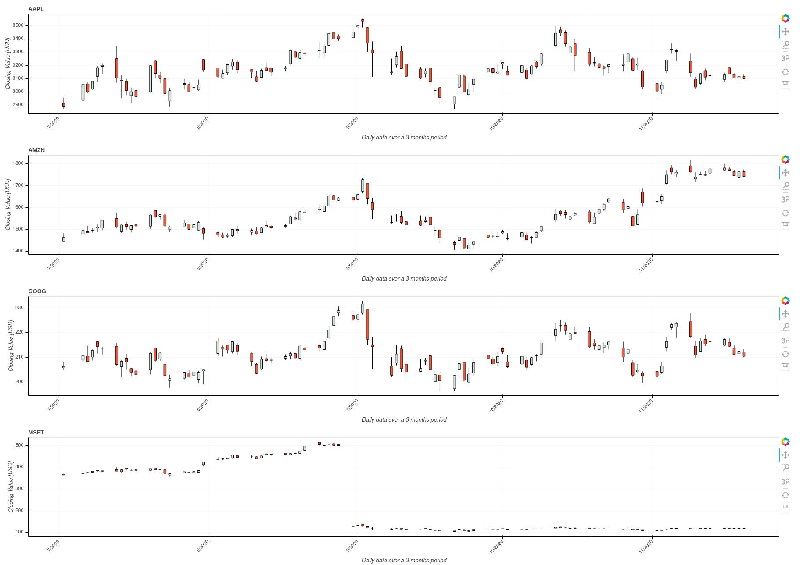

# Mini Python projects

This is where I store my mini projects written in Python.

## List of projects

1. Bookshop_database - simple database for a virtual library.



2. Coronavirus heatmap - queries latest results of the coronavirus world distribution from the web and presents the statistics on a world map.



3. Database webapp - running a database on a website, querying input from the user, reprocessing the input and sending the user an email with the reprocessed information.



4. English thesaurus - english dictionary querying the results from a MySQL database and detecting typos and giving suggestions to user's input.



5. Financial data visualization - queries latest 3mo Market values of Google, Amazon, Apple and Microsoft from the web and plots them on a candlestick chart on a website



6. Webcam motion detector - detects webcam movements and stores the information about the start and end time of the motions.


## How to run the code locally with *Bazel* already installed on host

### Bazel installation

[Install Bazel](https://docs.bazel.build/versions/master/install.html)

Once you have successfully installed *Bazel* you can run the code using:

```bash
bazel run //bookshop_database
bazel run //coronavirus_heatmap -- -o OUTPUT_PATH
bazel run //database_webapp
bazel run //english_thesaurus:english_thesaurus
bazel run //english_thesaurus:english_dictionary
bazel run //financial_data_visualization
bazel run //webcam_motion_detector
```

## Run the code inside a container

You can use my following Docker image to instantiate a container locally with Ubuntu and Bazel already installed:

```bash
docker run -it --rm framaxwlad/ubuntu_dev:latest
```

There you can simply clone the repository:

```bash
git clone https://github.com/FBorowiec/py_projects.git
cd py_projects/
```

And use the aforementioned commands to run the program:

```bash
bazel run //financial_data_visualization
```
